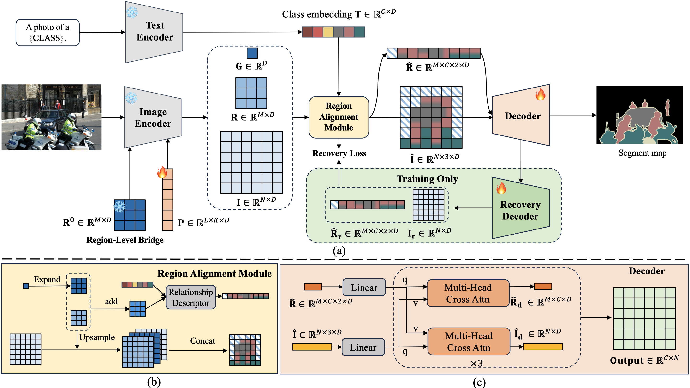

# [CVPR2024] Exploring Regional Clues in CLIP for Zero-Shot Semantic Segmentation(CLIP-RC). 
This is the PyTorch implementation of the paper : [Exploring Regional Clues in CLIP for Zero-Shot Semantic Segmentation](https://github.com/uyzhang/CLIP-RC).

[[`Paper #1`](https://github.com/uyzhang/CLIP-RC)] [[`BibTeX`](https://github.com/uyzhang/CLIP-RC?tab=readme-ov-file#citing-clip-rc)]

## Abstract
CLIP has demonstrated marked progress in visual recognition due to its powerful pre-training on large-scale image-text pairs. However, it still remains a critical challenge: how to transfer image-level knowledge into pixel-level understanding tasks such as semantic segmentation. In this paper, to solve the mentioned challenge, we analyze the gap between the capability of the CLIP model and the requirement of the zero-shot semantic segmentation task. Based on our analysis and observations, we propose a novel method for zero-shot semantic segmentation, dubbed **CLIP-RC** (CLIP with Regional Clues), bringing two main insights. On the one hand, a region-level bridge is necessary to provide fine-grained semantics. On the other hand, overfitting should be mitigated during the training stage. Benefiting from the above discoveries, CLIP-RC achieves state-of-the-art performance on various zero-shot semantic segmentation benchmarks, including PASCAL VOC, PASCAL Context, and COCO-Stuff 164K. 



## Table of contents
  
## Installation 
1. Clone the repository
    ```shell
    git clone https://github.com/uyzhang/CLIP-RC
    ```
    
2. Install the dependencies
    ```shell
    pip install torch==1.10.1+cu111 torchvision==0.11.2+cu111 -f https://download.pytorch.org/whl/cu111/torch_stable.html
    pip install -r requirements.txt
    mim install mmcv-full==1.4.4
    pip install mmsegmentation==0.24.0
    ```
3. Download the ViT-B-16 of the CLIP pre-training model from [OpenAI](https://openaipublic.azureedge.net/clip/models/5806e77cd80f8b59890b7e101eabd078d9fb84e6937f9e85e4ecb61988df416f/ViT-B-16.pt)

## Data Preparation
Please refer to [mmsegmentation](https://github.com/open-mmlab/mmsegmentation/blob/v0.24.0/docs/en/dataset_prepare.md) to prepare data

## Pretrained models

|     Dataset     |   Setting    |  pAcc | mIoU(S) | mIoU(U) | hIoU |                           Model Zoo                           |
| :-------------: | :---------:  | :---: | :-----: | :-----: | :--: |  :----------------------------------------------------------: |
| PASCAL VOC 2012 |  Inductive   |  95.8 |   92.8  |   84.4  | 88.4 | [[Google Drive](https://drive.google.com/file/d/177NlvVKd8XBDPgORPlyW1Bhs4cX_xD7i/view?usp=share_link)] |
| PASCAL VOC 2012 | Transductive |  97.0 |   93.9  |   92.2  | 93.0 | [[Google Drive](https://drive.google.com/file/d/1e42PVaURY1Ub0MRtiutnymcsL-PASfjk/view?usp=sharing)] |
| PASCAL VOC 2012 |    Fully     |  97.1 |   94.1  |   93.4  | 93.7 | [[Google Drive](https://drive.google.com/file/d/1nK7K_R5t3mbaWaamxUBNO5wYGdSbSW_i/view?usp=sharing)] |
| COCO Stuff 164K |  Inductive   |  63.1 |   40.9  |   41.6  | 41.2 | [[Google Drive](https://drive.google.com/file/d/1wFntgORB1q_H0WGU1JIAKOOsgXoE94Pe/view?usp=share_link)]|
| COCO Stuff 164K | Transductive |  69.9 |   42.0  |   60.8  | 49.7 | [[Google Drive](https://drive.google.com/file/d/1dD4wJNdLGJD-l-AdEYQ1dY9xousnbQLJ/view?usp=sharing)]|
| COCO Stuff 164K |    Fully     |  70.8 |   42.9  |   64.1  | 51.4 | [[Google Drive](https://drive.google.com/file/d/1-I859mSX9MblCXACcCc-2QlqmJHU7Jh1/view?usp=share_link)] |

## Usage


### Inductive Training
```shell
# for example
bash dist_train.sh configs/voc12/clip_rc_zero_vit-b_512x512_40k_voc_10_16.py work_dirs/clip_rc_zero_vit-b_512x512_40k_voc_10_16 2
```

### Transductive Training
```shell
# for example
bash dist_train.sh configs/voc12/clip_rc_zero_vit-b_512x512_20k_voc_10_16_st.py work_dirs/clip_rc_zero_vit-b_512x512_20k_voc_10_16_st 2 --load-from work_dirs/clip_rc_zero_vit-b_512x512_40k_voc_10_16/iter_20000.pth
```

### Fully supervised Training
```shell
# for example
bash dist_train.sh configs/voc12/clip_rc_fully_vit-b_512x512_40k_voc_10_16.py work_dirs/clip_rc_fully_vit-b_512x512_40k_voc_10_16 2
```

### Test
```shell
# for example
python test.py configs/voc12/clip_rc_zero_vit-b_512x512_40k_voc_10_16.py work_dirs/voc_zero.pth --eval mIoU
```

### Parameters and FLOPs
```shell
python get_flops.py configs/voc12/clip_rc_zero_vit-b_512x512_40k_voc_10_16.py --shape 512 512 --fvcore
```

## Acknowledgement
Our work is closely related to the following assets that inspire our implementation. We gratefully thank the authors. 

- [CLIP](https://github.com/openai/CLIP)
- [ZegCLIP](https://github.com/ZiqinZhou66/ZegCLIP)
- [Visual Prompt Tuning](https://github.com/KMnP/vpt)

## Citing CLIP-RC
If you find it helpful, you can cite our paper in your work.

```
@article{}
```
